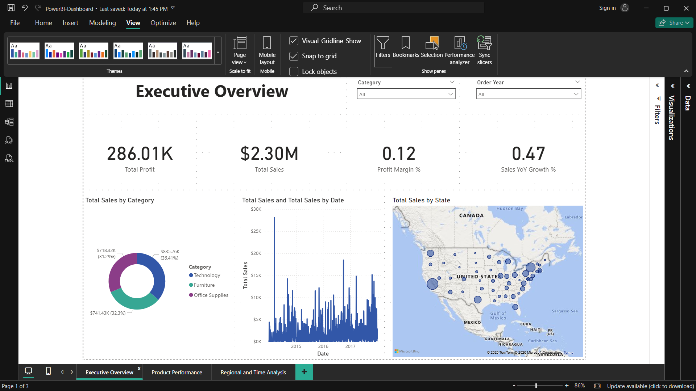
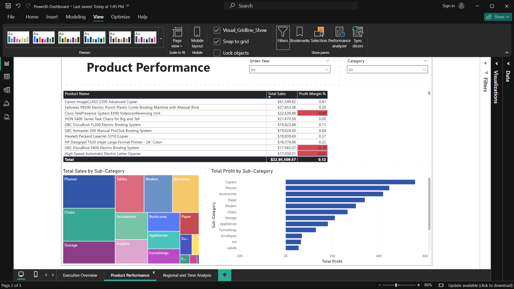
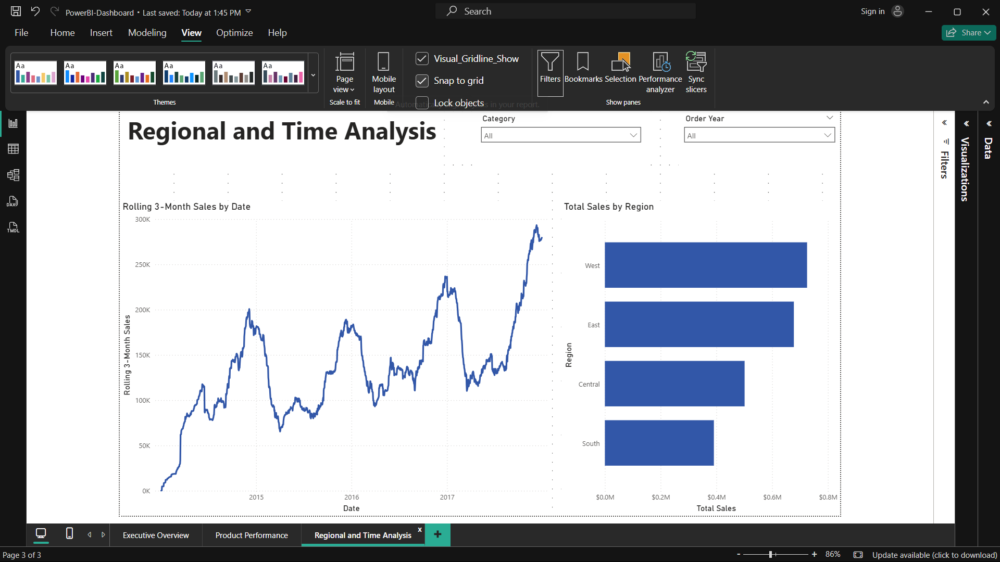

# Retail Sales Performance Dashboard

An end-to-end retail analytics project analyzing sales, profit, and regional performance using Excel, SQL, and Power BI — built on the Sample Superstore dataset (9,994 orders, 2014–2017).

## 📊 Overview

This project tracks retail performance across regions, product categories, and time, surfacing:

- Overall sales, profit, and profit margin at a glance
- Year-over-year growth trends
- Top and bottom performing products and sub-categories
- Regional sales distribution across the US

## 🖼️ Dashboard Preview

| Executive Overview                                          | Product Performance                                           |
| ----------------------------------------------------------- | ------------------------------------------------------------- |
|  |  |

| Regional and Time Analysis                                              | 
| ----------------------------------------------------------------------- | 
|  |

## 🛠️ Tech Stack

- **Excel** — initial data cleaning, calculated columns (Profit Margin, Order Processing Days, Order Year/Month)
- **SQL (SQLite)** — data aggregation and segment-level analysis
- **Python (Pandas)** — loading cleaned data into a SQL database
- **Power BI** — data modeling (DAX measures), interactive report building

## 📁 Project Workflow

1. **Data Cleaning (Excel)** — removed duplicates, standardized date formats, added calculated columns
2. **Load to SQL (`load_sql.py`)** — loaded the cleaned Excel file into a SQLite database (`superstore.db`) using Pandas
3. **SQL Analysis** — wrote queries to aggregate sales/profit by region, category, and product
4. **Power BI Modeling** — built a Date table and DAX measures (Total Sales, Total Profit, Profit Margin %, YoY Growth %, Rolling 3-Month Sales)
5. **Dashboard Build** — 4 report pages: Executive Overview, Product Performance, Regional and Time Analysis, and Product Detail (drill-through)

## 📈 Key Insights

_(Replace with your own numbers pulled from the dashboard/SQL queries)_

- Total Sales: **$2.30M** | Total Profit: **$286.01K** | Profit Margin: **12%**
- The **Tables** sub-category is a consistent loss-maker due to heavy discounting
- The **West** and **East** regions drive the largest share of total sales
- Sales show a clear seasonal spike in **Q4** each year

## 📂 Files in This Repo

| File                          | Description                                    |
| ----------------------------- | ---------------------------------------------- |
| `Sample - Superstore.csv`     | Raw source dataset                             |
| `superstore_clean.xlsx`       | Cleaned dataset with calculated columns        |
| `load_sql.py`                 | Python script to load cleaned data into SQLite |
| `superstore.db`               | SQLite database used for SQL analysis          |
| `retail-sales-dashboard.pbix` | Full interactive Power BI dashboard file       |
| `retail-sales-dashboard.pdf`  | Static PDF export of all dashboard pages       |
| `Screenshots/`                | PNG screenshots of each dashboard page         |

## ▶️ How to Use

- **View instantly:** open `retail-sales-dashboard.pdf` — no software needed
- **Explore interactively:** download `retail-sales-dashboard.pbix` and open it in [Power BI Desktop](https://powerbi.microsoft.com/desktop/) (free)
- **Check the SQL logic:** open `superstore.db` in [DB Browser for SQLite](https://sqlitebrowser.org/) (free) to run queries yourself

## 👤 Author

**Parth Dadasaheb Khamkar**
[LinkedIn](https://linkedin.com/in/parth-khamkar-704144241) · parth.d.khamkar2970@gmail.com
